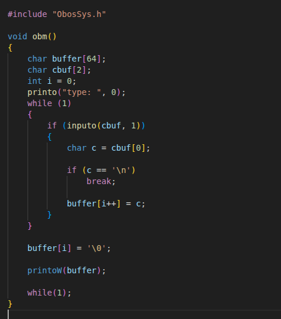

# OBOS

A Custom 32 bit operating system.
## Authors

- [@omersaban](https://github.com/Frogithezhrda)
- [@barakshalom](https://github.com/barakshalom)


## Deployment

To deploy this project run

```bash
  make clean
  make
  ./j or ./r or ./run.sh
```


## Features

* Bootloader
* Interrupt handling
* Paging (virtual memory)
* Heap allocator
* Round-robin scheduler
* Basic userspace
* System calls (with basic wrapper)
* VGA graphics driver
* Keyboard driver
* Timer driver
* RTC driver
* Console driver
* Basic sound driver
* Custom file system
* Basic network stack (IPv4, ICMP)
* Login page
* Snake game
* Calculator
* System stats tool
* DNS & DHCP
* UDP
* Graphic Interface

## Roadmap

* Improve sound driver
* Imporve graphical user interface (GUI)
* Enhance memory management
* Upgrade file system
* Fix and expand system stats
* Better User Space
* Better User Programs
## Demo


## Example

### User Program Example

* Example for a user program that reads from user



### Functions

* printo(const char* string, unsigned int color);
* getObosTicks(void);
* malloc(unsigned int size);
* free(void* ptr);
* getObosTime(Time* timePtr);
* sleepo(unsigned int ms);
* createFileo(const char* filename);
* deleteFileo(const char* filename);
* createDiro(const char* dirname);
* readFileo(const char* filename, char* buffer, unsigned int size); - Work In Progress
* writeFileo(const char* filename, const char* data, unsigned int size); - Work In Progress
* rando();
* inputo(char* buffer, unsigned int size);

* printoW(string); - same as printo prints only at white.
